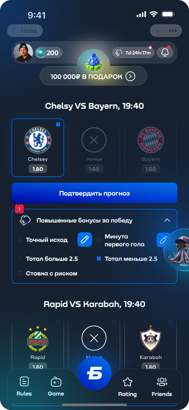

<div style="margin-top:0; padding-top:0" align="center">
<h1 style="margin-top:0">Telegram Mini App Betcity</h1>
  


<p>Used technology stack: <b>Vue 3 (Options API), SCSS, Vite, Telegram SDK</b></p>
</div>

This template should help get you started developing with Vue 3 in Vite.

## Recommended IDE Setup

[VSCode](https://code.visualstudio.com/) + [Volar](https://marketplace.visualstudio.com/items?itemName=Vue.volar) (and disable Vetur).

## Customize configuration

See [Vite Configuration Reference](https://vite.dev/config/).

## Project Setup

```sh
npm install
```

### Compile and Hot-Reload for Development

```sh
npm run dev
```

### Compile and Minify for Production

```sh
npm run build
```
